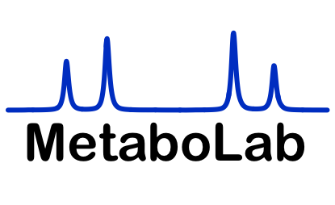

# MetaboLab 
Version: 0.99.7.6 

## Short Description

A container for a non-GUI version of MetaboLab, software for processing and analysing NMR data.

## Description

The MetaboLab software is an integrated software package for NMR data processing and analysis, closely linked to the previously developed NMRLab software. It includes tools for batch processing and gives access to a wealth of algorithms available in the MATLAB framework. Algorithms within MetaboLab help to optimize the flow of metabolomics data preparation for statistical analysis. The combination of an intuitive graphical user interface along with advanced data processing algorithms facilitates the use of MetaboLab in a broader metabolomics context.

This software has been adapted to function without a graphical user interface in a more automated mode to be used here in a docker container.

## Key features

- NMR processing and pre-processing for multi-variate analysis.

## Functionality

- Automated phase correction, alignment of spectra, automated baseline correction, exclusion of unwanted spectral regions, segmental alignment, TSA/PQN scaling, bucketing, noise filtering and generalised logarithmic transform. 

## Approaches

- Metabolomics

## Instrument Data Types

- The MetaboLab container is designed to process 1D data from Bruker and Agilent Spectrometers. 


## Tool Authors

- [Christian Ludwig](https://github.com/ludwigc) (University of Birmingham)
- Ulrich Guenther (University of Birmingham)


## Container Contributors

- [Michelle Reed](https://github.com/reedmac) (University of Birmingham)

## Website

- http://beregond.bham.ac.uk/~ludwigc/metabolab_intro/metabolab/ 

##  Git Repository

- https://github.com/reedmac/container-metabolab

## Installation

### Clone the container:

```bash
git clone https://github.com/reedmac/container-metabolab
```
### Initial testing using the MTBLS1_small dataset:

Change the paths in the 'commands' text file in the MTBLS1_small directory to match the paths to the directory containing your Dockerfile and the MTBLS1_small directory.
Make the entrypoint in the Dockerfile be:

   ENTRYPOINT ["/usr/local/bin/runTest1.sh"]

Execute commands script:
```bash
./commands 1
```
Examine the files 'output_check' and 'installed_ok' in MTBLS1_small for error messages.

### Processing your own data:

First, make sure the entrypoint in the Dockerfile is:

ENTRYPOINT ["/usr/local/bin/metabolab1d/run_MetaboLab1D.sh","/usr/local/bin/MATLAB_Runtime/v91","/mydata/container_script.ml"]

Secondly, remove any old images and build the docker image:

```bash
docker image rm --force imeta_image1
```

```bash
docker build -t imeta_image1 .
```

Next, prepare the data directory:

It must contain your metabolab script defining how the data should be processed. This must be called container_script.ml to match the name in Dockerfile.


Finally remove any old container and run the container:

```bash
docker rm imeta_container1
```

```bash
docker  run  -t -v  /path/to/your/data/directory:/mydata -w /mydata --name imeta_container1 imeta_image1
```

The results should now be in your data directory.

## Publications

- Günther UL, Ludwig C, Rüterjans H. NMRLAB - Advanced NMR Data Processing in Matlab. J Magn Reson. 2000; 145(2): 201-208. doi:10.1006/jmre.2000.2071

- Ludwig C, Günther U. MetaboLab - advanced NMR data processing and analysis for metabolomics. BMC Bioinformatics; 2011; 12:366-371. doi:10.1186/1471-2105-12-366

